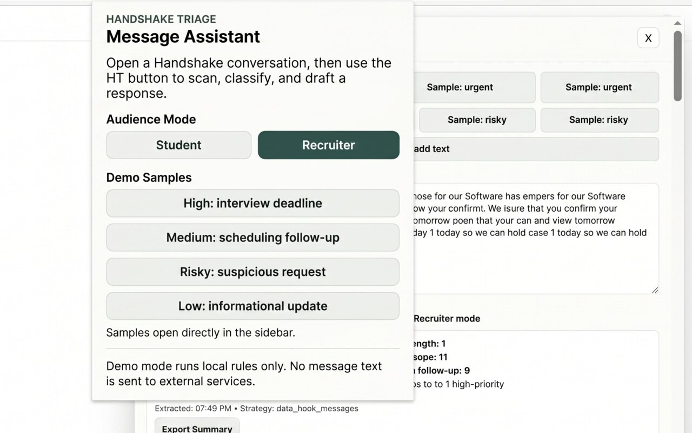
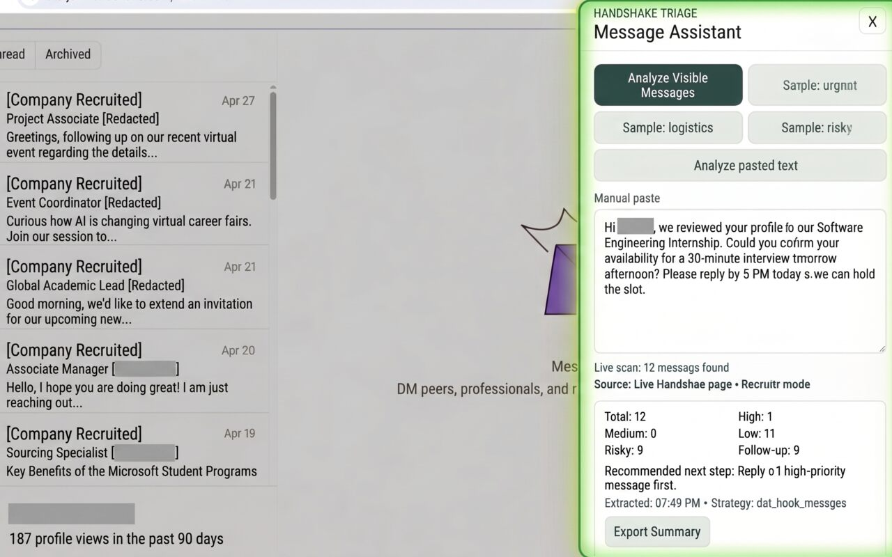
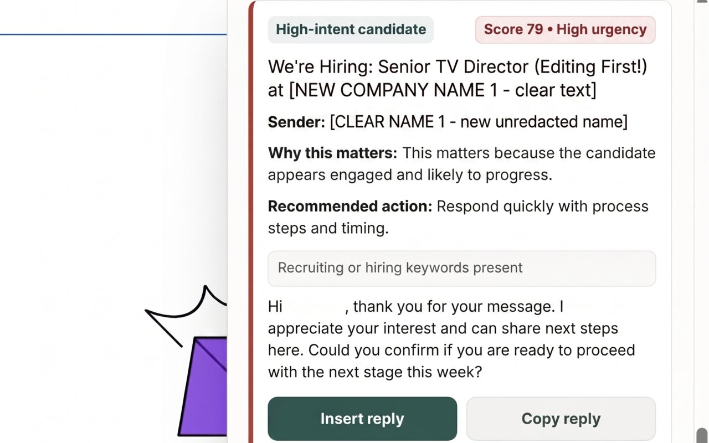
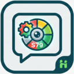

# Handshake Message Triage Assistant

Handshake Message Triage Assistant is a prototype Chrome extension that helps students avoid missing important career opportunities by prioritizing recruiter, employer, alumni, and career-services messages directly inside the browser.

## Working Status

- Extension loads in Chrome (Manifest V3).
- This is a prototype that uses deterministic local rules, not an external AI API.
- Real-time visible Handshake DOM extraction is enabled.
- Student/Recruiter mode toggle is available and persisted.
- Demo sample mode remains separate from live scan mode.
- Suggested replies are insert/copy only (no auto-send behavior).

## Showcase Pitch

- Student mode: "Helps students quickly detect high-impact messages and draft safe, timely responses."
- Recruiter mode: "Helps recruiters prioritize candidate communication, scheduling, and follow-up actions."

## Screenshots

### Home



### Dashboard



### Message Scoring



### Extension Icon



## Packaging Instructions (Load Unpacked)

1. Open `chrome://extensions`.
2. Turn on `Developer mode`.
3. Click `Load unpacked`.
4. Select the project root folder for this repo (the folder containing [manifest.json](manifest.json)).
5. Open Handshake in a tab and launch the extension popup from the `HT` button.

## Quick Usage

1. Pick mode in popup: `Student` or `Recruiter`.
2. In the panel, click `Analyze Visible Messages` for a live scan.
3. Use `Sample: ...` buttons only when you want demo data.
4. Use `Insert reply` or `Copy reply` for drafts.

## Test Commands

```bash
npm test
npm run validate
```

## Privacy

Processing is local to the extension runtime:

- Message extraction from the current page DOM is done locally.
- Classification and reply drafting are deterministic local rules.
- No external API keys are required.
- No message auto-send behavior exists.
- Export summary excludes full raw text by default.

This project is intended for prototype/demo use in the Chrome Web Store, so the copy should stay explicit that it is rule-based and not a live AI assistant.

## What Is Processed Locally

- Visible message text currently on the page.
- Sender/timestamp hints when present in DOM.
- Mode selection (`student` or `recruiter`) via local extension storage.

## Known Limitations

- Handshake DOM extraction is heuristic and may need selector tuning if markup changes.
- Reply insertion depends on composer field detection in the active page.
- Deterministic classifier can be improved further with richer context windows.

## Demo Script (60s)

1. Open Handshake conversation and click `HT`.
2. Run `Analyze Visible Messages` and show source label (`Live Handshake page`).
3. Highlight category, score, urgency, why-this-matters, and recommended action.
4. Switch mode (`Student` -> `Recruiter`) and re-run to show perspective change.
5. Use `Insert reply` (no auto-send) and close with local-processing privacy note.
